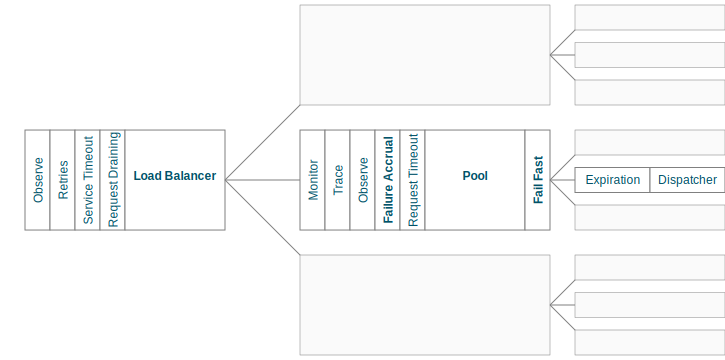

.. _finagle_clients:

Clients
=======

Finagle clients adheres to a simple :src:`interface <com/twitter/finagle/Client.scala>` for
construction:

::

  def newClient(dest: Name, label: String): ServiceFactory[Req, Rep]

That is, given a logical destination and an identifier, return a function
that produces a typed `Service` over which requests can be dispatched.
There are variants of this constructor for stateless clients that create a simple
`Service`, for example:

::

  def newService(dest: Name, label: String): Service[Req, Rep]

As of :doc:`6.x <changelog>`, client implementations are encouraged to expose
this interface on a Scala object named after the protocol implementation. This
results in a uniform way to construct clients, ``Protocol.newClient(...)``. For
example:

::

    Http.newClient(...)
    Memcached.newClient(...)

Clients can further furnish the resulting `ServiceFactory` with protocol
specific API's. A common pattern is to expose a ``newRichClient`` method that
does exactly this. For cases like Thrift, where IDLs are part of
the rich API, a more specialized API is exposed. See the protocols section on
:ref:`Thrift <thrift_and_scrooge>` for more details.

Client Modules
--------------

A default Finagle client is designed to maximize success and minimize latency.
Each request dispatched through a client will flow through various modules that
help it achieve these goals. The modules are logically separated into three
stacks: the `loadbalancer stack` balances requests across multiple endpoints, the
`endpoint stack` provides failure management and connection pooling, and
the `connection stack` provides connection life-cycle management and implements
the wire protocol.

    Fig. 1: A visual representation of each module in a default Finagle client
    that is configured with three endpoints and connections.

Module Composition
^^^^^^^^^^^^^^^^^^

A materialized Finagle client is a :ref:`ServiceFactory <service_factory>`. It produces
:ref:`Services <services>` over which requests can be dispatched. The modules in
`Fig. 1` are defined in terms of a `ServiceFactory` and thus are composed via the usual
:ref:`combinators <composing_services_filters>`. An important consequence of this is that
modules deeper in the stack can affect the behavior and availability of the client. For example,
this is how failure management modules mark entire endpoints as unavailable.

Observability
^^^^^^^^^^^^^

The ``Observe``, ``Monitor``, and ``Trace`` modules export useful information about the internals and
behavior of a Finagle client. Client metrics are exported using a :src:`StatsReceiver <com/twitter/finagle/stats/StatsReceiver>`
(See the :ref:`metrics <public_stats>` section for more details). Generic exception handling can
be installed via the :src:`MonitorFilter <com/twitter/finagle/filter/MonitorFilter.scala>`.
Finally, clients have built-in support for `Zipkin <http://twitter.github.com/zipkin/>`_.

Timeouts & Expiration
^^^^^^^^^^^^^^^^^^^^^

Finagle provides timeout facilities with fine granularity:

The ``Service Timeout`` module defines a timeout for service acquisition. That is,
it defines the maximum time allotted to a request to wait for an available service. Requests
that exceed this timeout are failed with a `ServiceTimeoutException`. This module
is implemented by the :src:`TimeoutFactory <com/twitter/finagle/factory/TimeoutFactory.scala>`

The ``Request Timeout`` module is a filter and thus gives an upper bound on the amount of
time allowed for a request to be outstanding. An important implementation detail of the
:src:`TimeoutFilter <com/twitter/finagle/service/TimeoutFilter.scala>` is that it attempts
to cancel the request when a timeout is triggered. With most protocols, if the request has
already been dispatched, the only way to cancel the request is to terminate the connection.

The ``Expiration`` module is attached at the connection level and expires a service after a
certain amount of idle time. The module is implemented by
:src:`ExpiringService <com/twitter/finagle/service/ExpiringService.scala>`.

:ref:`Stats <idle_apoptosis_stats>`

Finally, timeouts can be enforced outside of these modules on a per-request level using
`Future#within` [#]_:

::

  val f = client(request)
  f.within(1.seconds) onSuccess { ... } onFailure { ... }

.. [#] The `Future#raiseWithin` variant creates a new future
       that attempts to cancels the original future if a timeout
       occurs.

Request Draining
^^^^^^^^^^^^^^^^

The ``Drain`` module guarantees that the client delays closure until all
outstanding requests have been completed. It wraps each produced service with
a :src:`RefCountedService <com/twitter/finagle/service/RefcountedService.scala>`.

Load Balancer
^^^^^^^^^^^^^

.. _load_balancer:

The role of the load balancer is to equally distribute requests over a collection
of endpoints. The default balancing strategy, implemented by the
:src:`HeapBalancer <com/twitter/finagle/loadbalancer/HeapBalancer.scala>`, is
to pick the host with the least number of outstanding requests, which is similar to a
least connections strategy in other load balancers. Additionally, the load balancer
deliberately introduces jitter to avoid synchronicity (and thundering herds) in a
distributed system and to ensure even balancing when request concurrency is low.
The load balancer also takes endpoint availability into consideration (as defined
by `ServiceFactory#isAvailable`). If all endpoints are unavailable the load balancer
ignores this field and continues to balance on least loaded. This remains true until
a host becomes available again.

:ref:`Stats <loadbalancer_stats>`

Failure Accrual
^^^^^^^^^^^^^^^

The ``Failure Accrual`` module marks itself as unavailable based on the number of observed
failures. The module remains unavailable for a predefined duration. Recall
that the availability is propagated through the stack. Thus the load balancer
will avoid using an endpoint where the failure accrual module is unavailable.
The module is implemented by :src:`FailureAccrualFactory <com/twitter/finagle/service/FailureAccrualFactory.scala>`.

Pooling
^^^^^^^

.. _watermark_pool:

Finagle provides a generic pool that maintains a collection of
service instances. Each endpoint the client connects to has an independent
pool with high and low watermarks. The :src:`WatermarkPool <com/twitter/finagle/pool/WaterMarkPool.scala>` keeps
persistent services up to the lower bound. It will keep making new services up
to upper bound if you checkout more than lower bound services, but when
you release those services above the lower bound, it immediately tries
to close them. This, however, creates a lot of connection churn if your
application consistently requires more than lower bound connections.

.. _caching_pool:

As a result, there is a separate facility for caching, with some TTL,
services above the lower bound. The :src:`CachingPool <com/twitter/finagle/pool/CachingPool.scala>`
caches *regardless* of whether there are more than lower-bound open services;
it's always caching up to (upper-bound - lower-bound) services. The cache reaches
its peak value when you reach your peak concurrency (i.e. "load"),
and then slowly decays, based on the TTL.

The default client stack layers both pools which amounts to
maintaining the low watermark (as long as request concurrency exists),
queuing requests above the high watermark, and applying a TTL for
services that are between [low, high].

:ref:`Stats <pool_stats>`

Fail Fast
^^^^^^^^^

The :src:`FailFast <com/twitter/finagle/service/FailFastFactory.scala>` module
attempts to reduce the number of requests dispatched to endpoints that are likely
to fail. It works by marking downed hosts when a connection fails, and launching a
background process that repeatedly attempts to reconnect with a given backoff schedule.
During the time that a host is marked down, the factory is marked unavailable (and thus
the load balancer above it will avoid its use). The factory becomes available
again on success or when the back-off schedule runs out.

:ref:`Stats <fail_fast_stats>`

Retries
^^^^^^^

Finagle provides a configurable :src:`RetryingFilter <com/twitter/finagle/service/RetryingFilter.scala>`.
The filter can be configured either to retry a specific number of times or to adhere to a back-off strategy.
By default, the RetryingFilter *does not assume your RPC service is idempotent*. Retries occur only when they
are known to be safe. That is, when Finagle can guarantee the request was never delivered to the
server.

There is no direct protocol or annotation support for marking endpoints as idempotent.
A common workaround is to create separate client instances for issuing non-idempotent requests.
For example, one could keep separate client objects for reads and writes, the former configured to retry on
any request failure and the latter being more conservative in order to avoid conflicting writes.

Configuration
-------------

Prior to :doc:`6.x <changelog>`, the `ClientBuilder` was the primary method for configuring
the modules inside a Finagle client. We've moved away from this model for various
:ref:`reasons <configuring_finagle6>`.
