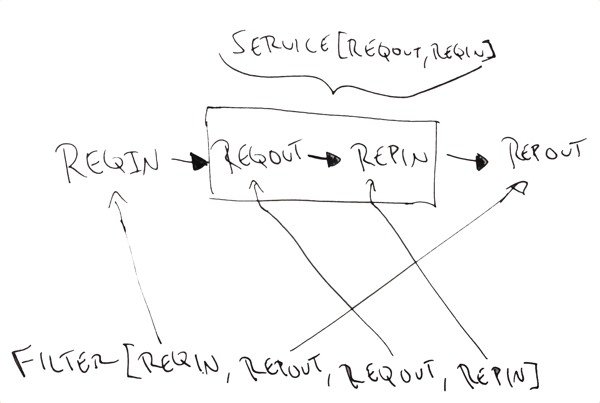

Services & Filters
==================

Services and filters constitute the core abstractions with which
clients and servers are constructed with the Finagle network library.
They are very simple, but also quite versatile. Most of Finagle's
internals are structured around Services and Filters.

.. _services:

Services
--------

A service, at its heart, is a simple function:

.. code-block:: scala

	trait Service[Req, Rep] extends (Req => Future[Rep])

Put another way, a service takes some request of type `Req` and returns
to you a :doc:`Future <Futures>` representing the eventual result (or failure)
of type `Rep`.

Services are used to represent both clients and servers. An *instance*
of a service is used through a client; a server *implements* a `Service`.

To use an HTTP client:

.. code-block:: scala

	val httpService: Service[HttpRequest, HttpResponse] = ...

	httpService(new DefaultHttpRequest(...)).onSuccess { res =>
	  println("received response "+res)
	}

or to provide an HTTP server:

.. code-block:: scala

	val httpService = new Service[HttpRequest, HttpResponse] {
	  def apply(req: HttpRequest) = ...
	}

Services implement *application logic*. You might, for instance,
define a `Service[HttpRequest, HttpResponse]` to implement your
application's external API.

Filters
-------

It is often useful to define *application-agnostic* behavior as well.
A common example of this is to implement timeouts: if a request
fails to complete within a certain time, the timeout mechanism fails
it with a timeout exception.

Like services, filters are also simple functions:

.. code-block:: scala

	abstract class Filter[-ReqIn, +RepOut, +ReqOut, -RepIn]
	  extends ((ReqIn, Service[ReqOut, RepIn]) => Future[RepOut])

or: given a request of type `ReqIn` and a service of type
`Service[ReqOut, RepIn]`, return a Future of type `RepOut` (the reply
type). All types are parameterized so that filters may also transform
request or reply types; visualized:

.. xxx
  .. image:: _static/filter.png

In most common cases, `ReqIn` is equal to `ReqOut`, and `RepIn` is
equal to `RepOut` — this is in fact sufficiently common to warrant its
own alias:

.. code-block:: scala

	trait SimpleFilter[Req, Rep] extends Filter[Req, Rep, Req, Rep]

This, then, is a complete definition of a timeout filter:

.. code-block:: scala

	class TimeoutFilter[Req, Rep](timeout: Duration, timer: Timer)
	    extends SimpleFilter[Req, Rep]
	{
	  def apply(request: Req, service: Service[Req, Rep]): Future[Rep] = {
	    val res = service(request)
	    res.within(timer, timeout)
	  }
	}

The filter is given a request and the next service in the filter chain.
It then dispatches this request, applying a timeout on the returned
`Future` — `within` is a method on `Future` which applies the given
timeout, failing the future with a timeout exception should it fail
to complete within the given deadline.

.. _composing_services_filters:

Composing filters and services
------------------------------

Filters and services compose with the `andThen` method. For example
to furnish a service with timeout behavior:

.. code-block:: scala

	val service: Service[HttpRequest, HttpResponse] = ...
	val timeoutFilter = new TimeoutFilter[HttpRequest, HttpResponse](...)

	val serviceWithTimeout: Service[HttRequest, HttpResponse] =
	  timeoutFilter andThen service

Applying a filter to a `Service` produces a new `Service` whose requests
are first filtered through `timeoutFilter`.

We can also compose filters with `andThen`, creating composite filters,
so that

.. code-block:: scala

	val timeoutFilter = new TimeoutFilter[..](..)
	val retryFilter = new RetryFilter[..](..)

	val retryWithTimeoutFilter: Filter[..] =
	  retryFilter andThen timeoutFilter

creates a filter that dispatches requests first through `retryFilter` and
then `timeoutFilter`.

.. _service_factory:

ServiceFactory
--------------

In certain modules, it's important to take into account the process of acquiring
a `Service`. For example, a connection pool would need to play a significant role
in the `Service` acquisition phase. The `ServiceFactory` exists for this exact reason.
It produces `Service`'s over which requests can be dispatched. Its definition:

.. code-block:: scala

	abstract class ServiceFactory[-Req, +Rep]
		extends (ClientConnection => Future[Service[Req, Rep]])

Internally, Finagle makes heavy use of this. In Finagle's client and server stacks, modules
are lifted into ServiceFactories and then composed using the aforementioned combinators.

