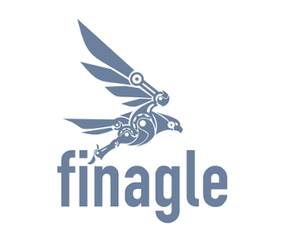

Finagle is an extensible RPC system for the JVM, used to construct
high-concurrency servers. Finagle implements uniform client and
server APIs for several protocols, and is designed for high
performance and concurrency. Most of Finagle's code is protocol
agnostic, simplifying the implementation of new :doc:`protocols <Protocols>`.

Finagle uses a *clean*, *simple*, and *safe* concurrent programming
model, based on :doc:`Futures <Futures>`. This leads to safe and
modular programs that are also simple to reason about.

Finagle clients and servers expose statistics for monitoring and
diagnostics. They are also traceable through a mechanism similar to
Dapper_'s (another Twitter open source project, Zipkin_, provides
trace aggregation and visualization).

The :doc:`quickstart <Quickstart>` has an overview of the most
important concepts, walking you through the setup of a simple HTTP
server and client.

A section on :doc:`Futures <Futures>` follows, motivating and
explaining the important ideas behind the concurrent programming
model used in Finagle. The next section documents
:doc:`Services & Filters <ServicesAndFilters>` which are the core
abstractions used to represent clients and servers and modify
their behavior.

Other useful resources include:

- `Your Server as a Function <https://monkey.org/~marius/funsrv.pdf>`_, a paper motivating the core abstractions behind finagle (`PLOS’13 <https://sigops.org/sosp/sosp13/plos.html>`_).
- `Twitter engineering blog entry introducing Finagle <https://blog.twitter.com/2011/finagle-a-protocol-agnostic-rpc-system>`_
- Twitter's `Scala School <https://twitter.github.io/scala_school/>`_ has a section `introducing Finagle <https://twitter.github.io/scala_school/finagle.html>`_ and another `constructing a distributed search engine using Finagle <https://twitter.github.io/scala_school/searchbird.html>`_
- `Finagle 101 <https://kostyukov.net/posts/finagle-101/>`_ by Vladimir Kostyukov

.. _Dapper: https://research.google.com/pubs/pub36356.html
.. _Zipkin: https://zipkin.io

Contents
--------

.. toctree::
   :caption: User's Guide
   :maxdepth: 1

   Quickstart
   Futures
   ServicesAndFilters
   Configuration
   ApertureLoadBalancers
   Servers
   Clients
   ThreadingModel
   Contexts
   Names
   Protocols
   Metrics
   Flags
   UnsuccessfulResponses
   Tracing
   Compression
   FAQ
   Glossary

.. toctree::
   :caption: Developer's Guide
   :maxdepth: 1

   developers/Extending
   developers/Futures
   developers/SignalingFailure

.. toctree::
   :caption: Notes
   :maxdepth: 1

   changelog
   license

.. API reference,
  additional, etc.  as different ones
  examples
  protocol specific docs?
  scaladoc
